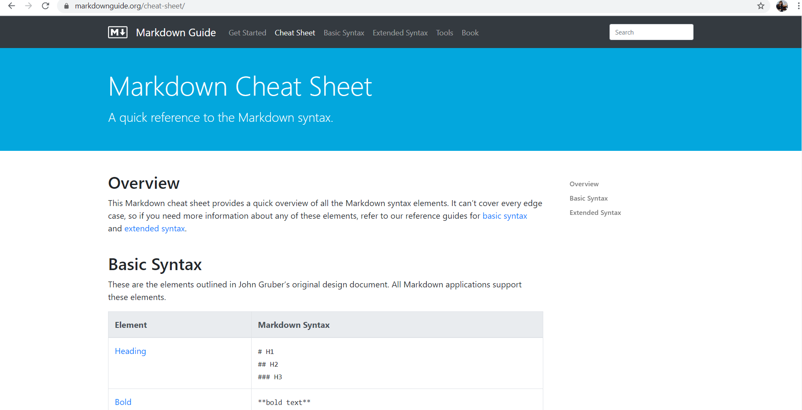

# python_dataviz

 ## พันทิพา มุขกัง  603021876-4

 # การติดตั้งโปรแกรม Miniconda
 ### 1 ดาวโหลดโปรแกรม Miniconda
 
 
 ### 2 เมื่อติดตั้งเสร็จเรียบร้อยแล้วเปิดตัวโปรแกรมขั้นมาพร้อมเลือกโฟล์เดอร์ที่จะทำการเก็บข้อมูลไว้ โดยพิมว่าcd ตามด้วยชื่อโฟล์เดอร์ที่เราคัดลอกมา

### 3 เรียกใช้งาน jupyter ด้วยคำสั่ง jupyter notebook

# การใช้งาน Google Colab
### 1 ทำการเสิร์ชคำว่า colab ได้เลย มันจะขึ้นหน้าเว็บไซต์ของ google colab โดยต้องทำการ sing in ก่อนการใช้งาน พอลงชื่อเข้าใช้งานแล้ว >> คลิกคำว่า new python3 notebook

### 2 ไปที่File >>เลือก Downlond.ipynb เพื่อดาวโหลดไว้ที่โฟล์เดอร์ที่เราต้องการเก็บ

# การใช้งาน Github
### 1 เข้าเว็บไซต์ Github จะปรากฎหน้าตาการเข้าใช้งาน >> คลิก sing in ลงชื่อเข้าใช้งาน

### 2 เข้าระบบแล้ว >> ไปที่ New repository >> กรอกชื่องานพร้อมทั้งตั้งค่าให้คนอื่นสามารถเข้ามาดูผลงานของเราได้หรือไม่ เมื่อตั้งค่าเสร็จ >> ลิกที่ Create repository

### 3 คลิก Clone or Downlond เพื่อคัดลอก URL

### 4 ทำการติดตั้ง github โดยใช้คำสั่ง conda install -c anaconda git (ทำการติดตั้งไปแล้ว)

### คำสั่งการใช้ github
#### คำสั่งที่1 git clone ตามด้วย URL ที่เราคัดลอกมา

#### คำสั่งที่2 git status เพื่อตรวจสอบว่าไฟล์ใดยังไม่ได้เชื่อมกับอินเตอร์เน็ต

#### คำสั่งที่3 git add เพื่อเพิ่มไฟล์ที่ยังไม่ได้เชื่อมกับอินเตอร์เน็ต โดยทการเพิ่มไฟล์เข้าไป ด้วยคำสั่ง git add ามด้วยไฟล์ที่ต้องการaddเข้า

#### คำสั่งที่4 git commit เพื่อทำการตรวจสอบก่อนการอัปโหลดลง github โดยใช้คำสั่ง git commit -m "test git"

#### คำสั่งที่5 git push เพื่ออัปโหลดไฟล์ไปในgithub โดยต้องกรอก Username และ Password เสมอ  

# การติดตั้งโปรแกรม Visual Studio Code
### 1 ทำการโหลดโปรแกรม Visual Studio Code 

### 2 ใช้โปรแกรม Visual Stydio Code โดยการเปิดที่โปรแกรม Anaconda ด้วยคำสั่ง code.

## Markdown Cheat Sheet
### เป็นคู่มือในการหาCode ที่จะใช้ เช่น จะใส่รูปภาพ ก็ค้นหาcodeที่ใช้ใส่รูปภาพได้เลย
